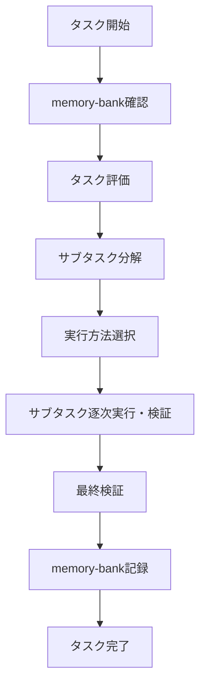
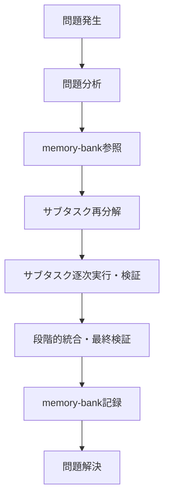

# タスク実行ガイドライン

## はじめに

このガイドラインでは、タスクを効率よく実行し、高品質な成果物を作成するための手順を説明します。タスクを実行する際は、以下のプロセスに従ってください。

---

## 共通ルール

- コミュニケーションはすべて日本語で行います。
- タスク開始前に必ずmemory-bankを確認します。
- タスクは明確なサブタスクに分解し、各サブタスク完了後に逐次検証します。
- TDD（テスト駆動開発）が適さない場合は代替アプローチを使用します。
- 問題が発生した場合はサブタスクをさらに細分化し、即時検証を行います。

---

## タスクの実行フロー

以下のフローチャートに示す手順でタスクを進めてください。



---

## タスク着手テンプレート

```
# タスク着手：[タスク名]

## memory-bankの確認
- 確認結果：
- 活用可能な情報：

## タスク評価
- TDDの適性：[あり/なし]
- スコープ内での完了：[可能/不可能]
- 採用するアプローチ：[TDD/代替アプローチ]

## サブタスク分解
1. [サブタスク1]
2. [サブタスク2]

## 実行計画
- サブタスク1：[実行方法]
- サブタスク2：[実行方法]

## 検証計画
- サブタスク1：[検証方法]
- サブタスク2：[検証方法]
- 最終検証：[達成目標]
```

---

## 実行アプローチ

### TDDアプローチ（コード実装向け）

1. テストコードを作成します。
2. テストの失敗を確認します。
3. 最小限のコードを実装します。
4. テストを実行し、必要に応じて修正します。
5. 全テストが成功するまで繰り返します。

### 代替アプローチ

1. 検証基準を定義します。
2. ソリューションを実装します。
3. 実装直後に検証します。
4. 問題があれば修正します。

---

## タスク完了条件

- 各サブタスク完了後の検証が成功すること。
- 最終検証が成功すること。
- 結果や知見をmemory-bankに記録すること。

---

## 問題対応フロー



1. 問題を特定し、分析します。
2. memory-bankを参照します。
3. 問題をより細かなサブタスクに分解します。
4. サブタスクを逐次実行し、即時検証します。
5. サブタスクを段階的に統合し、最終検証します。
6. 解決方法をmemory-bankに記録します。

---

## ベストプラクティス

- memory-bankを最大限活用します。
- 変更ごとに即時検証を行います。
- 問題が生じた際は迅速に再分解・検証します。
- 自動テストや検証ツールを積極的に使用します。

---

以上のプロセスに従い、タスクを円滑かつ確実に進めてください。

