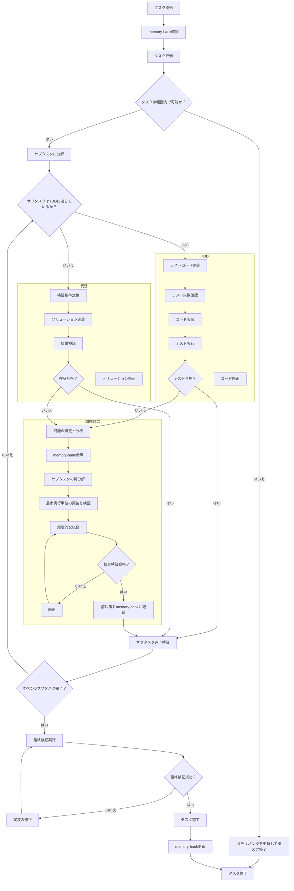

# タスク実行ルール（拡張版）

**重要：すべてのコミュニケーションは日本語で行わなければなりません。これは選択肢ではなく必須事項です。**

**重要：すべてのタスクは、このドキュメントで定義されたプロセスに厳密に従って実行しなければなりません。タスク着手時には必ず以下のテンプレートを使用してください。**

このドキュメントでは、タスクをサブタスクに分解し、適切な方法で実行・検証するためのガイドラインを提供します。これらのガイドラインに従うことで、一貫性のある信頼性の高い高品質なコードを確保できます。

**注意：memory-bankの詳細な構造とルールについては、`.clinerules/04-memory-bank.md`を参照してください。**

## タスク着手テンプレート

タスクに着手する際は、必ず以下のテンプレートを使用してください：

```
# タスク着手：[タスク名]

## ステップ0：memory-bankの確認
- memory-bankの確認結果：[関連情報の有無と概要]
- 活用可能な情報：[再利用可能なコード、解決策などの要約]

## ステップ1：タスクの性質と範囲を評価
- タスクの性質：[TDDに適している/適していない]
- 範囲内で完了可能：[はい/いいえ]
- 選択するアプローチ：[TDD/代替アプローチ]

## ステップ2：タスクの分解
- サブタスク1：[説明]
- サブタスク2：[説明]
- サブタスク3：[説明]
...

## ステップ3：実行アプローチの選択
- 選択したアプローチ：[TDD/代替アプローチ]
- 理由：[選択理由の説明]

## ステップ4：サブタスクの実行計画
- サブタスク1の実行方法：[説明]
- サブタスク2の実行方法：[説明]
...

## ステップ5：検証方法
- サブタスク1の検証方法：[具体的なテストコマンドまたはテスト条件]
- サブタスク2の検証方法：[具体的なテストコマンドまたはテスト条件]
...
- 最終的なタスク成功条件：[実行して成功すべき最終コマンド/テスト]
```

---

## タスク実行プロセス

### ステップ0：memory-bankの確認
- **アクション：** タスク着手前にmemory-bankを確認し、関連情報や再利用可能なリソースを特定します。
- **目標：** 過去の知見を活用し、効率的なタスク実行を促進します。
- **参照：** memory-bankの詳細なルールと構造については`.clinerules/04-memory-bank.md`を参照してください。

### ステップ1：タスクの性質と範囲を評価する
- **アクション：** タスクがTDDに適しているか、与えられた範囲内で完了できるかを評価します。
- **目標：** 適切な実行アプローチを決定し、タスクの実現可能性を確認します。

### ステップ2：タスクを分解する
- **アクション：** 全体的なタスクを明確な小さなサブタスクに分解します。
- **目標：** 各サブタスクは焦点を絞り、管理可能で、独立して検証できるものにします。

### ステップ3：実行アプローチを選択する
- **アクション：** タスクの性質に基づいて、TDDまたは代替アプローチを使用するかを決定します。
- **目標：** 各サブタスクに最も適した方法論を選択します。

### ステップ4：各サブタスクを実行する
- **アクション：** 選択したアプローチ（TDDまたは代替）を使用して各サブタスクを完了します。
- **目標：** タスクの各コンポーネントに対して、動作する検証済みのソリューションを作成します。
- **問題発生時の対応：** サブタスクで問題が発生した場合は、そのサブタスクをさらに小さな実行単位に分解し、各単位を個別に実装・検証します。

### ステップ5：サブタスクの完了を検証する
- **アクション：** サブタスクが正常に完了し、すべての要件を満たしていることを確認します。
- **目標：** 次のサブタスクに進む前に各サブタスクが完全に機能することを確認し、着実で信頼性の高い進行を維持します。
- **検証頻度：** 各サブタスクの実装後、またはサブタスク内の各実行単位の完了後に即時検証を行います。
- **検証方法：** 事前に定義した具体的なテストコマンドや条件を使用して、各サブタスクの正常動作を確認します。

### ステップ6：最終検証の実行
- **アクション：** すべてのサブタスクが完了した後、タスク全体に対する最終検証を実行します。
- **目標：** タスク全体が要件を満たし、すべてのテストが成功することを確認します。
- **検証基準：** 最終的なタスク成功条件として定義されたコマンドやテストを実行し、成功を確認します。
- **重要事項：** 最終検証が成功しない限り、タスクは完了とみなされません。

### ステップ7：memory-bankの更新
- **アクション：** タスク完了後、得られた知見、解決策、再利用可能なコードなどをmemory-bankに記録します。
- **目標：** 将来のタスク実行のための知識ベースを構築し、効率性と一貫性を向上させます。
- **方法：** `.clinerules/04-memory-bank.md`に定義されたルールとフォーマットに従ってmemory-bankを更新します。

---

## タスク実行アプローチ

### TDDアプローチ（コード実装タスク向け）
タスクがテスト可能なコードの実装を含む場合：

1. **テストコードの実装**
   - 期待される動作を定義するテストを作成します。
   - サブタスクを複数の小さなテストケースに分割します。

2. **テスト失敗の確認**
   - 実装前にテストを実行して、失敗することを確認します。
   - 各テストケースを個別に確認します。

3. **コードの実装**
   - テストに合格するために必要な最小限のコードを作成します。
   - 一度に1つのテストケースを解決するように実装します。

4. **テストの実行**
   - 各実装ステップ後に即時テストを実行します。
   - テストが失敗した場合は、合格するまでコードを改良します。
   - テストに合格してから次のテストケースに進みます。

5. **最終検証**
   - すべてのテストケースが成功していることを確認します。
   - 定義された最終検証コマンドが成功することを確認します。

### 代替アプローチ（TDDに適さないタスク向け）
タスクがTDDに適していない場合：

1. **検証基準の定義**
   - 成功した完了のための明確な基準を確立します。
   - 複数の小さな検証ポイントを定義します。
   - 最終検証のための具体的なコマンドや条件を明確にします。

2. **ソリューションの実装**
   - 要件に従ってサブタスクを実行します。
   - 一度に小さな変更を加え、各変更後に検証を行います。

3. **結果の検証**
   - 各実装ステップ後に即時検証を行います。
   - 検証基準に対して結果を評価します。
   - 検証が失敗した場合は、実装を修正します。

4. **最終検証**
   - サブタスクの完了後、定義された最終検証コマンドを実行します。
   - コマンドやテストが成功するまでタスクは完了とみなされません。

---

## タスク終了条件

タスクが完了とみなされるには、以下の条件をすべて満たす必要があります：

### 必須の終了条件
1. **すべてのサブタスクが完了していること**
   - 各サブタスクが個別に検証され、成功していること。

2. **最終検証が成功していること**
   - タスク着手時に定義された最終的なタスク成功条件を満たしていること。
   - 指定されたテストコマンドが成功していること。
   - すべての自動テストがパスしていること。

3. **コード変更だけでは不十分**
   - コードの変更だけでなく、そのコードが実際に期待通りに動作することが検証されること。
   - テストやコマンドの実行結果が成功を示していること。

4. **memory-bankが更新されていること**
   - タスク中に得られた知見や解決策がmemory-bankに記録されていること。

### 追加の確認事項
- タスク全体の目標が達成されていること。
- 発生した問題や学んだ教訓が記録されていること。
- 次のタスクに役立つ情報がmemory-bankに含まれていること。

**注意：** コードの変更だけではタスクの終了条件を満たしません。必ず定義された検証コマンドやテストが成功することを確認してください。

---

## サブタスク内での問題対応プロセス

サブタスク実行中に問題が発生した場合は、以下のプロセスに従ってください：

### ステップ1：問題の特定と分析
- **アクション：** 問題の正確な性質と範囲を特定します。
- **目標：** 問題の根本原因を理解し、適切な対応策を決定します。

### ステップ2：memory-bankの参照
- **アクション：** 類似の問題や解決策がmemory-bankに記録されていないか確認します。
- **目標：** 過去の経験から学び、効率的な問題解決を促進します。
- **参照：** `.clinerules/04-memory-bank.md`に定義されたルールに従ってmemory-bankを参照します。

### ステップ3：サブタスクの再分解
- **アクション：** 問題のあるサブタスクをさらに小さな実行単位に分解します。
- **目標：** 問題の範囲を限定し、部分的な進捗を可能にします。

### ステップ4：最小実行単位の実装と検証
- **アクション：** 分解した最小実行単位ごとに実装と検証を行います。
- **目標：** 各実行単位が正しく機能することを即時に確認します。
- **検証方法：** 具体的なテストコマンドや条件を使用して、各実行単位の動作を確認します。

### ステップ5：段階的な統合
- **アクション：** 検証済みの実行単位を段階的に統合し、各統合ステップで検証を行います。
- **目標：** 統合によって新たな問題が発生していないことを確認します。

### ステップ6：サブタスクの完了確認
- **アクション：** すべての実行単位が統合され、サブタスク全体が正しく機能することを確認します。
- **目標：** サブタスク全体の完了を確認し、次のサブタスクに進みます。
- **重要事項：** 定義されたテストコマンドが成功するまでサブタスクは完了とみなされません。

### ステップ7：解決策のmemory-bank記録
- **アクション：** 問題の性質と解決策をmemory-bankに記録します。
- **目標：** 将来の類似問題の効率的な解決を支援します。
- **方法：** `.clinerules/04-memory-bank.md`に定義されたルールとフォーマットに従ってmemory-bankを更新します。

---

## タスク実行のフロー図

以下の図は、拡張されたタスク実行のプロセスを示しています：



---

## 最小実行単位の定義と管理

### 最小実行単位の特徴
- 一つの明確な機能または目的を持つ
- 独立して実装・検証可能
- 5〜15行程度のコードまたは単一の論理的変更で実現可能
- 明確な入力と期待される出力を持つ
- 具体的な検証コマンドまたはテスト条件を定義できる

### 最小実行単位テンプレート

問題のあるサブタスクを再分解する際は、以下のテンプレートを使用してください：

```
# サブタスク再分解：[サブタスク名]

## 問題の分析
- 発生した問題：[問題の説明]
- 影響範囲：[影響を受ける機能/コンポーネント]
- 想定される原因：[考えられる原因]
- memory-bankの関連情報：[memory-bankから取得した関連情報]

## 最小実行単位への分解
- 実行単位1：[説明]
- 実行単位2：[説明]
- 実行単位3：[説明]
...

## 実装・検証計画
- 実行単位1の実装・検証方法：[検証コマンド/テスト条件を含む]
- 実行単位2の実装・検証方法：[検証コマンド/テスト条件を含む]
...

## 統合計画
- 統合ステップ1：[説明]
- 統合ステップ2：[説明]
...

## 統合検証方法
- 統合ステップ1の検証方法：[検証コマンド/テスト条件]
- 統合ステップ2の検証方法：[検証コマンド/テスト条件]
...
```

---

## タスク実行のベストプラクティス

- **memory-bankの積極的活用：**  
  タスク着手前と問題発生時にmemory-bankを参照し、過去の知見を活用します。詳細なルールは`.clinerules/04-memory-bank.md`を参照してください。

- **進捗の文書化：**  
  進捗状況を記録し、計画からの逸脱があれば記録します。

- **各ステップの即時検証：**  
  小さな変更を行うたびに即時検証を行い、問題の早期発見と修正を促進します。

- **適切な方法の選択：**  
  各サブタスクの性質に基づいて、TDDまたは代替アプローチを選択します。

- **高品質の維持：**  
  タスクに適した検証方法を使用して、高品質な結果を確保します。

- **段階的な進行：**  
  常に一つのサブタスクを完了してから次に進み、各段階での成功を確認します。

- **範囲の評価：**  
  実装を開始する前に、タスクが与えられた範囲内で完了できるかどうかを評価します。

- **問題の早期分解：**  
  問題が発生したら、大きな変更を続けるのではなく、小さな単位に分解して解決します。

- **検証の自動化：**  
  可能な限り、検証プロセスを自動化し、効率的な繰り返し検証を実現します。

- **知識の共有：**  
  得られた知見や解決策をmemory-bankに記録し、チーム全体で活用できるようにします。

- **コマンド/テスト成功の確認：**  
  コード変更だけでなく、定義されたコマンドやテストが成功することを必ず確認します。

---

## タスクスコープ評価

大きなリソースをタスクに投入する前に、与えられた範囲内でタスクを完了できるかどうかを評価します：

### ステップ1：タスク要件の評価
- **アクション：** タスクが必要とするものを徹底的に分析します。
- **目標：** すべての必要なコンポーネントと依存関係を明確に理解します。

### ステップ2：利用可能なリソースの評価
- **アクション：** 必要なすべてのリソース、ツール、情報が利用可能かどうかを判断します。
- **目標：** タスク完了に必要なすべてのものがアクセス可能であることを確認します。

### ステップ3：memory-bankのチェック
- **アクション：** `.clinerules/04-memory-bank.md`に定義されたルールに従って、類似のタスクや関連する知見を確認します。
- **目標：** 過去の経験を活用し、より正確なスコープ評価を行います。

### ステップ4：検証方法の確認
- **アクション：** タスクの成功を検証するための具体的なコマンドやテストケースを特定します。
- **目標：** 明確で測定可能な成功基準を確立し、検証方法を確保します。

### ステップ5：決定を下す
- **アクション：** 実装を進めるか、メモリバンクを更新して終了するかを決定します。
- **目標：**  
  - **タスクが可能な場合：** 通常のタスク実行フローに進みます。  
  - **タスクが範囲内で不可能な場合：** メモリバンクに制限を文書化し、現在のタスクを終了します。

---

## 即時検証の実施ガイドライン

### コード変更の即時検証
- **原則：** コードの変更は最小単位で行い、各変更後に即時検証を行います。
- **方法：**
  - 1つの機能または修正ごとに検証を実行します。
  - 自動テストが利用可能な場合は、変更後に必ず実行します。
  - 手動検証が必要な場合は、明確な手順を定義して実行します。
  - 定義された検証コマンドを実行し、結果を確認します。

### 検証結果の記録
- **原則：** すべての検証結果を記録し、問題が発生した場合は詳細を文書化します。
- **方法：**
  - 検証の成功または失敗を記録します。
  - 実行したコマンドと出力結果を記録します。
  - 失敗した場合は、エラーメッセージや現象を詳細に記録します。
  - 成功した変更はコミットメッセージまたは進捗報告に記録します。

### 問題発生時の即時対応
- **原則：** 問題が発生した場合は、即座に対応し、問題の範囲を限定します。
- **方法：**
  - 問題の原因を特定するための追加テストを実行します。
  - 問題の範囲を特定し、最小単位に分解します。
  - 必要に応じて前の安定状態に戻します。
  - memory-bankを参照して類似問題の解決策を探します。

### 最終検証の実施
- **原則：** すべてのサブタスクが完了した後、タスク全体に対する最終検証を実施します。
- **方法：**
  - 定義された最終検証コマンドを実行します。
  - 自動テストスイートがある場合は、全テストを実行します。
  - 検証が失敗した場合は、問題を特定して修正します。
  - 検証が成功するまでタスクは完了とみなされません。

---

## タスク実行チェックリスト

各サブタスクを実行する際は、以下のチェックリストに従ってください：

- [ ] タスク着手前にmemory-bankを確認する（`.clinerules/04-memory-bank.md`参照）
- [ ] サブタスクの目的と期待される結果を明確に述べる
- [ ] 選択したアプローチ（TDDまたは代替）に基づいて実行する
- [ ] 各実装ステップ後に即時検証を行う
- [ ] 問題が発生した場合は、memory-bankを参照する
- [ ] 必要に応じてサブタスクを最小実行単位に再分解する
- [ ] 各最小実行単位を実装し、即時に検証する
- [ ] 検証済みの実行単位を段階的に統合し、各ステップで検証する
- [ ] 実行中に発生した問題や課題を記録する
- [ ] 具体的な検証コマンドまたはテストを実行し、成功を確認する
- [ ] サブタスクの完了を検証する
- [ ] 次のサブタスクに進む前に結果を報告する
- [ ] 解決した問題や再利用可能なコードをmemory-bankに記録する

## タスク完了チェックリスト

タスク全体を完了する際は、以下のチェックリストに従ってください：

- [ ] すべてのサブタスクが完了したことを確認する
- [ ] 各サブタスクの結果が期待通りであることを検証する
- [ ] 最終検証コマンドを実行し、成功を確認する
- [ ] すべての自動テストが成功することを確認する
- [ ] タスク全体の目標が達成されたことを確認する
- [ ] 発生した問題や学んだ教訓を記録する
- [ ] `.clinerules/04-memory-bank.md`に定義されたルールに従ってmemory-bankを更新する
- [ ] 次のタスクに役立つ情報がmemory-bankに含まれていることを確認する

## まとめ

- **memory-bank活用：**
  タスク着手前にmemory-bankを確認し、完了後に更新することで、知識の蓄積と再利用を促進します。詳細は`.clinerules/04-memory-bank.md`を参照してください。

- **タスク実行：**  
  タスクをサブタスクに分解し、適切な方法論（適切な場合はTDD、そうでない場合は代替）を選択し、前進する前に各段階での成功を確認します。
  
- **スコープ評価：**  
  タスクが与えられた範囲内で完了できるかどうかを判断します。不可能な場合は、メモリバンクを更新してタスクを終了します。
  
- **段階的な進行：**  
  常に一つのサブタスクを完了してから次に進み、各段階での成功を確認します。

- **問題発生時の対応：**  
  問題が発生した場合は、サブタスクを最小実行単位に再分解し、各単位を個別に実装・検証してから段階的に統合します。

- **即時検証の実施：**  
  小さな変更を行うたびに即時検証を実施し、問題の早期発見と修正を促進します。

- **知識の共有と蓄積：**
  得られた知見、解決策、再利用可能なコードをmemory-bankに記録し、将来のタスク実行の効率を向上させます。

- **コマンドとテストの成功確認：**
  コード変更だけではなく、定義されたコマンドやテストが成功することを確認し、タスクの完了を判断します。

- **最終検証の必須化：**
  すべてのサブタスクが完了した後、最終検証コマンドを実行し、タスク全体の成功を確認します。これはタスク完了の必須条件です。

- **テンプレートとチェックリストの使用：**
  すべてのタスクで定義されたテンプレートとチェックリストを使用し、一貫性のあるプロセスを確保します。

これらのガイドラインを採用することで、高い開発基準を維持し、透明性を確保し、セッションのメモリがリセットされても円滑なプロジェクトの進行を促進できます。また、問題発生時の効率的な対応と知識の蓄積により、開発ロスを最小限に抑えることができます。