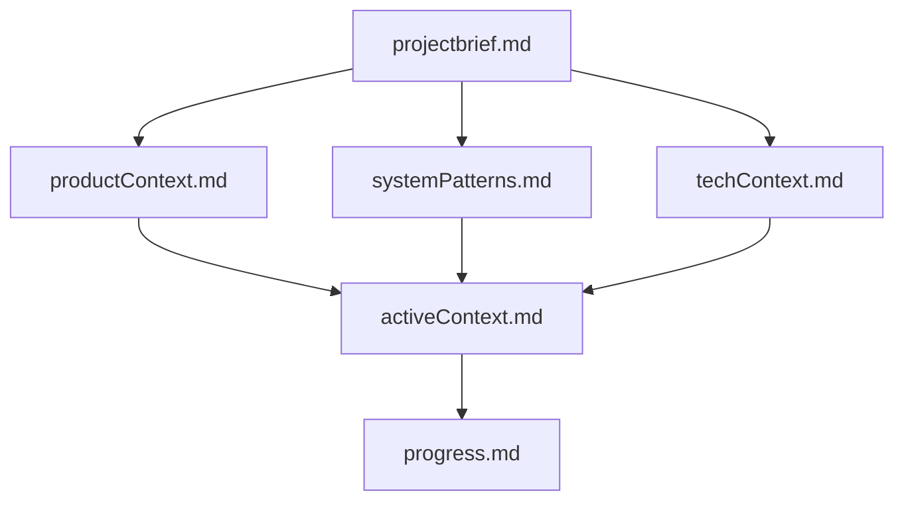
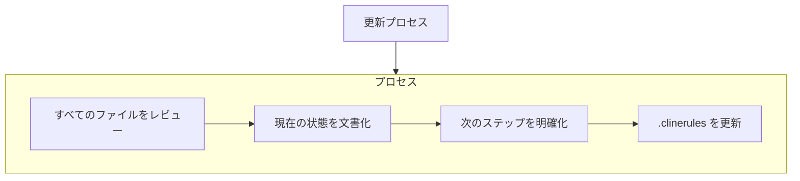

# メモリバンク管理ルール

**重要：すべてのコミュニケーションは日本語で行わなければなりません。これは選択肢ではなく必須事項です。**

このドキュメントでは、プロジェクトの文脈、進捗状況、技術的決定を記録するためのメモリバンク管理のガイドラインを提供します。システムはセッション間でメモリをリセットするため、最新のメモリバンクを維持することが不可欠です。

---

## メモリバンクの構造

メモリバンクは、階層的な構造で整理された核となるファイルとオプションのコンテキストファイルで構成されています：

---

## 核となるメモリバンクファイル

1. **`projectbrief.md`**  
   - **目的：** プロジェクトの基盤を確立します。  
   - **内容：** 核となる要件、プロジェクトの目標、範囲の定義。

2. **`productContext.md`**  
   - **目的：** プロジェクトの背後にある理由を説明します。  
   - **内容：** 対処する問題、ユーザー体験の目標、全体的な価値提案。

3. **`activeContext.md`**  
   - **目的：** 現在の焦点と最近の変更を追跡します。  
   - **内容：** 最近の更新、進行中の決定、次のステップ。

4. **`systemPatterns.md`**  
   - **目的：** システムアーキテクチャと設計パターンを文書化します。  
   - **内容：** 主要な技術的決定、コンポーネントの関係、使用される設計パターン。

5. **`techContext.md`**  
   - **目的：** プロジェクトの技術的側面を詳述します。  
   - **内容：** 使用される技術、開発環境、技術的制約、依存関係。

6. **`progress.md`**  
   - **目的：** 進捗状況を監視し、さらなる作業が必要な領域を特定します。  
   - **内容：** 現在のステータス、完了したタスク、未解決の問題、計画された改善。

---

## メモリバンクの更新

メモリバンクの更新は、以下のシナリオで行われるべきです：

- **新しいパターン：** 新しいプロジェクトパターンが発見されたとき。
- **重要な変更：** 主要な変更や更新を実装した後。
- **ユーザーリクエスト：** 更新が明示的に要求されたとき（「メモリバンクを更新して」によってトリガーされる）。
- **コンテキストの明確化：** 現在の状態や次のステップについて追加の明確さが必要なとき。
- **タスクスコープの制限：** タスクが与えられた範囲内で完了できないとき。
- **方法論の適応：** タスク実行アプローチを変更する必要があるとき。
- **ファイル構造の変更：** ファイル編成に重要な変更が実装されたとき。

メモリバンクを更新するための簡略化されたフローは以下の通りです：

---

## メモリバンク管理のベストプラクティス

- **定期的な更新：**  
  重要な変更や発見の後、メモリバンクを定期的に更新します。

- **包括的な文書化：**  
  技術的決定、設計パターン、進捗状況を包括的に文書化します。

- **明確な次のステップ：**  
  次のステップと未解決の問題を明確に文書化します。

- **一貫した形式：**  
  すべてのメモリバンクファイルで一貫した形式と構造を使用します。

- **相互参照：**  
  関連する情報を相互参照し、メモリバンク全体の一貫性を確保します。

---

## タスク実行とメモリバンク管理の統合

タスク実行プロセスとメモリバンク管理は、堅牢な開発ワークフローをサポートするために連携して機能します：

- **タスク実行** は、前進する前に各機能が徹底的に検証されることを保証します。
- **メモリバンク管理** は、セッション間で継続性を維持し、情報に基づいた決定を下すために必要なコンテキストと歴史的な洞察を提供します。

これらの実践を統合することで、一貫した進歩、高品質、プロジェクトコンテキストの明確な理解をサポートする規律ある開発環境を作成します。

---

## まとめ

- **メモリバンク構造：**  
  核となるプロジェクトファイルとコンテキストファイルを含む構造化された文書を維持し、継続性を確保するために定期的に更新します。

- **包括的な文書化：**  
  技術的決定、設計パターン、進捗状況を包括的に文書化し、セッション間で一貫性を維持します。

- **タスク実行との統合：**  
  メモリバンク管理をタスク実行プロセスと統合し、情報に基づいた決定と円滑なプロジェクト進行をサポートします。

これらのガイドラインを採用することで、セッションのメモリがリセットされても、プロジェクトの文脈と進捗状況の明確な理解を維持できます。
