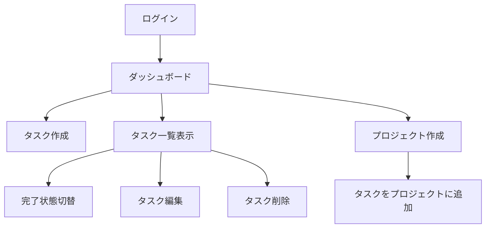
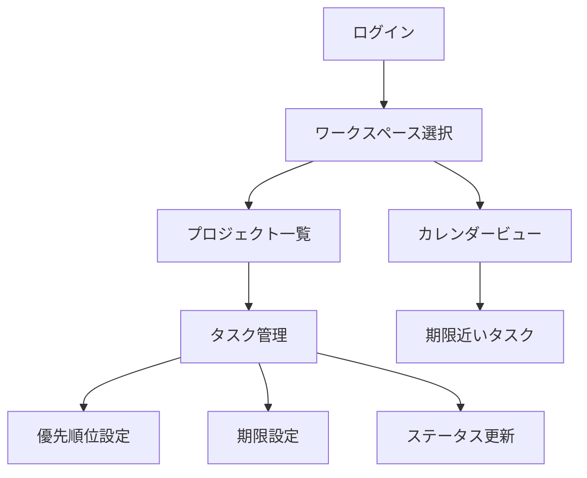
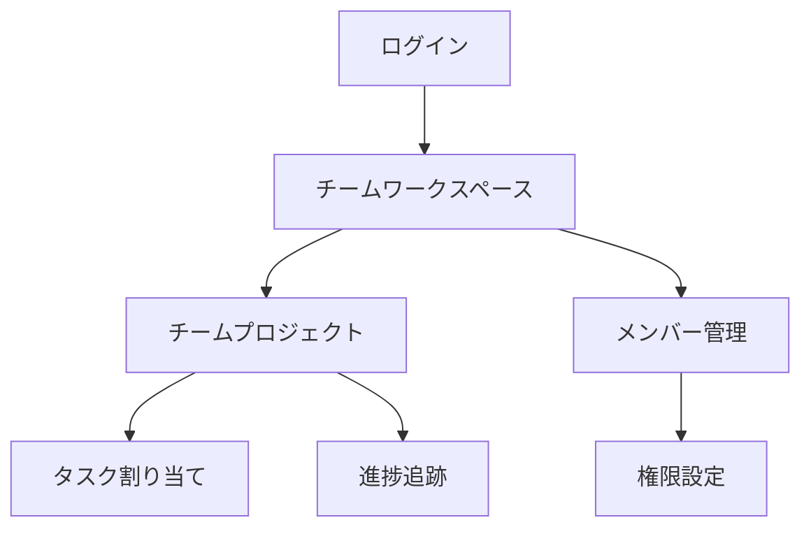

# 製品コンテキスト

## 解決する問題
- タスク管理の複雑さと非効率性
- プロジェクト間のタスク整理の難しさ
- チームでのタスク共有と進捗追跡
- 期限管理とタスクの優先順位付け

## ユーザーペルソナ
- 個人ユーザー：日常タスク管理
- プロフェッショナル：仕事関連タスク整理
- チームリーダー：タスク割り当てと進捗追跡

## UX目標
- シンプルで直感的なUI
- 迅速なタスク作成・編集
- 効果的なタスク整理・分類
- 明確な進捗視覚化
- シームレスなナビゲーション
- レスポンシブデザイン

## 主要機能フロー
1. **タスク管理**
   - CRUD操作と完了状態切替
   - 優先順位付けと期限設定

2. **プロジェクト管理**
   - プロジェクト作成・管理
   - タスク整理と進捗追跡

3. **ワークスペース管理**
   - 複数ワークスペース作成
   - プロジェクト整理と設定カスタマイズ

## 差別化要因
- シンプルさと使いやすさ
- 階層構造による柔軟な整理
- モダンで高速なウェブアプリ体験
- API連携の可能性

## ユーザーストーリー

### 個人ユーザー

### プロフェッショナルユーザー

### チームリーダー

## ユーザーインターフェース要件

### ダッシュボード
- タスク概要（完了/未完了）
- 期限近いタスク
- プロジェクト進捗
- クイックアクション

### タスク管理画面
- リスト表示
- フィルタリングとソート
- 一括操作
- ドラッグ&ドロップ

### プロジェクト管理画面
- プロジェクト概要
- タスクリスト
- 進捗グラフ
- メンバー表示

### ワークスペース管理画面
- ワークスペース一覧
- プロジェクト整理
- 設定カスタマイズ
- メンバー管理

## アクセシビリティ要件
- キーボードナビゲーション
- スクリーンリーダー対応
- 高コントラストモード
- フォントサイズ調整
- 色覚異常対応

## 将来の拡張可能性
- チーム機能拡張
- カレンダー統合
- モバイルアプリ
- 通知システム
- サードパーティ連携（Slack, GitHub等）
- AIによるタスク提案
