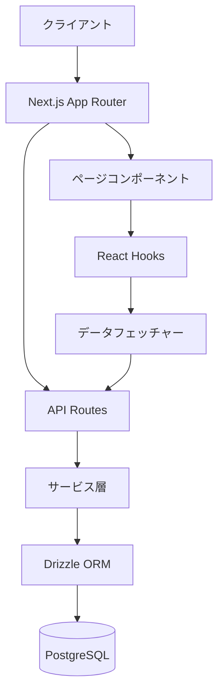
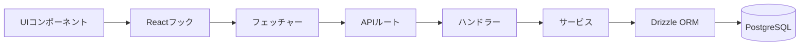
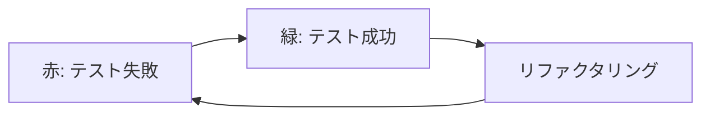

# システムパターン

## アーキテクチャ概要
このプロジェクトはNext.jsを使用したフルスタックアプリケーションで、以下の主要なアーキテクチャパターンを採用しています：

## 主要コンポーネント

### フィーチャーベースの構造
プロジェクトは「フィーチャー」ごとに構造化されており、各フィーチャーは以下のコンポーネントを含みます：

- **スキーマ**: データモデルの定義
- **コンポーネント**: UIコンポーネント
- **フェッチャー**: APIからデータを取得するロジック
- **ハンドラー**: イベント処理ロジック
- **フック**: Reactカスタムフック
- **サービス**: ビジネスロジック
- **ミドルウェア**: リクエスト処理の中間層

### データフロー

## 設計パターン

### リポジトリパターン
DrizzleORMを使用してデータアクセス層を抽象化し、データベース操作をカプセル化しています。

### サービス層パターン
ビジネスロジックをサービス層に分離し、APIルートとデータアクセス層の間の仲介役として機能します。

### フック抽象化パターン
Reactカスタムフックを使用してUIコンポーネントからデータフェッチングロジックを分離しています。

### フィーチャーモジュールパターン
機能ごとにコードを整理し、関連するコンポーネント、ロジック、スキーマを一つのディレクトリにまとめています。

## 技術的決定

### テスト駆動開発（TDD）
開発プロセスとしてテスト駆動開発（TDD）を採用しています：

#### TDDの基本サイクル
1. **赤（Red）**: 失敗するテストを最初に書く
   - 実装したい機能を明確に定義する
   - 期待される動作を検証するテストを作成する
   - この時点ではテストは必ず失敗する

2. **緑（Green）**: テストが通るように最小限のコードを実装する
   - テストをパスするために必要な最小限のコードのみを書く
   - 「動作する」コードを書くことに集中し、完璧さは求めない
   - すべてのテストが成功することを確認する

3. **リファクタリング（Refactor）**: コードをリファクタリングして品質を向上させる
   - コードの品質を改善する（可読性、保守性、効率性）
   - テストが引き続き成功することを確認しながら改善を行う
   - 設計の原則やパターンを適用する

このサイクルを繰り返すことで、高品質で堅牢なコードベースを構築します。

#### TDDの実装方法
- **Jest**: テストフレームワークとして使用
- **ESLint + Jest Plugin**: テストコードの品質確保
- **テスト構造**:
  - `__tests__`ディレクトリに各コンポーネントのテストを配置
  - サービス層とハンドラー層の両方にテストを実装
  - モックを活用して依存関係を分離

#### TDDの利点
- **設計の明確化**: 実装前に期待される動作を明確にする
- **回帰バグの防止**: 自動テストによる継続的な検証
- **リファクタリングの安全性**: 変更による影響を即座に検出
- **ドキュメントとしての役割**: テストが仕様の一部として機能
- **開発の集中**: 一度に一つの問題に集中できる

#### TDDとESLintの連携
- テスト実行前にESLintによる構文チェックを実施
- カンマ抜けなどの構文エラーを早期に検出
- コードスタイルの一貫性を確保

### Next.js App Router
ルーティング、サーバーサイドレンダリング、APIエンドポイントを統合するためにNext.jsのApp Routerを採用しています。

### Drizzle ORM
型安全なSQLクエリビルダーとしてDrizzle ORMを選択し、マイグレーション管理とスキーマ定義を簡素化しています。

### Docker開発環境
PostgreSQLデータベースを含む開発環境をDockerで構築し、環境の一貫性を確保しています。

### フィーチャーベースのディレクトリ構造
機能ごとにコードを整理することで、関連するファイルを一箇所にまとめ、メンテナンス性と拡張性を向上させています。
