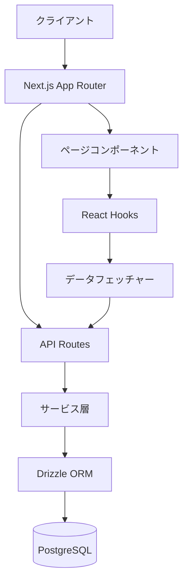
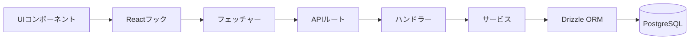
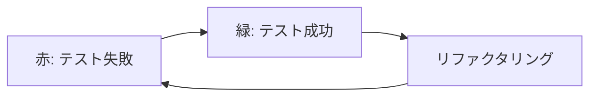
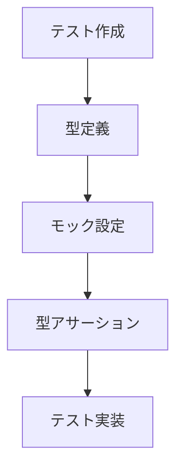
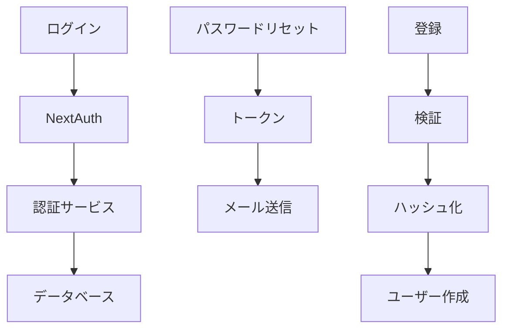

# システムパターン

## アーキテクチャ概要
Next.jsを使用したフルスタックアプリケーション：

## フィーチャーベース構造
各フィーチャーは以下を含む：
- **スキーマ**: データモデル定義
- **コンポーネント**: UI
- **フェッチャー**: データ取得ロジック
- **ハンドラー**: イベント処理
- **フック**: Reactカスタムフック
- **サービス**: ビジネスロジック
- **ミドルウェア**: リクエスト処理中間層

## データフロー

## 設計パターン
- **リポジトリパターン**: DrizzleORMによるデータアクセス抽象化
- **サービス層パターン**: ビジネスロジック分離
- **フック抽象化**: UIからデータフェッチング分離
- **フィーチャーモジュール**: 機能ごとのコード整理

## テスト駆動開発（TDD）

### TDDサイクル
1. **赤**: 失敗するテスト作成
2. **緑**: 最小限のコード実装
3. **リファクタリング**: 品質向上

### TDD例外
- スキーマファイル（`schema.ts`）はTDD対象外
- マイグレーションで検証

### テストファイルのESLintエラー解消

1. **型定義ファイル作成**
2. **適切な型アサーション**
3. **@ts-expect-errorの適切使用**
4. **tsconfig.json設定**

## 技術選定
- **Next.js App Router**: ルーティング・SSR・API統合
- **Drizzle ORM**: 型安全SQLクエリビルダー
- **Docker**: 開発環境一貫性確保
- **フィーチャーベース構造**: メンテナンス性・拡張性向上

## 認証システム（NextAuth）

- **NextAuthアダプター**: Drizzle連携
- **認証ロジック**: パスワード管理・トークン処理
- **APIルート分離**: 標準・カスタムエンドポイント
- **パスワード管理分離**: 独立テーブル使用
