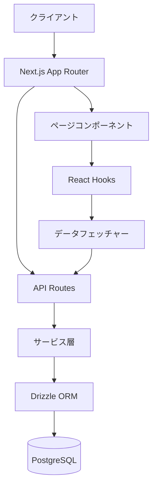
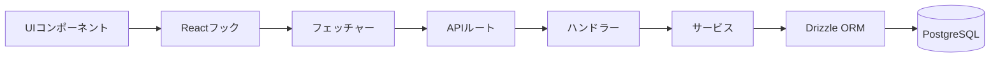
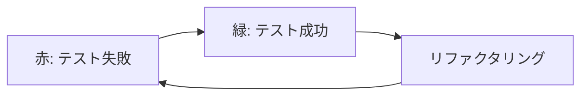
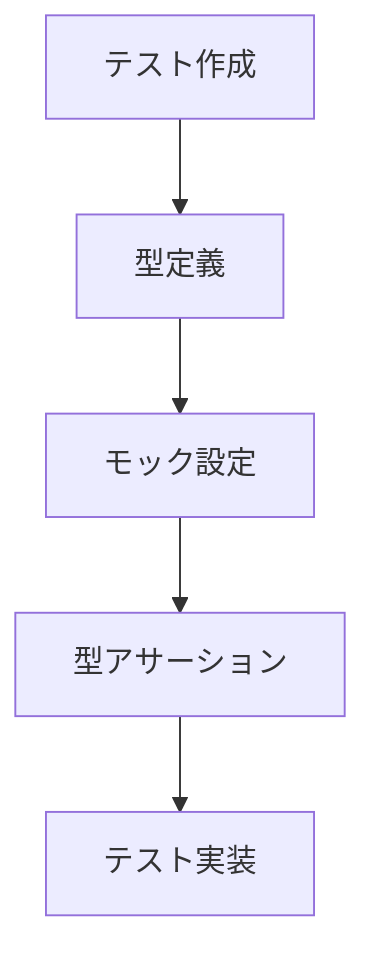
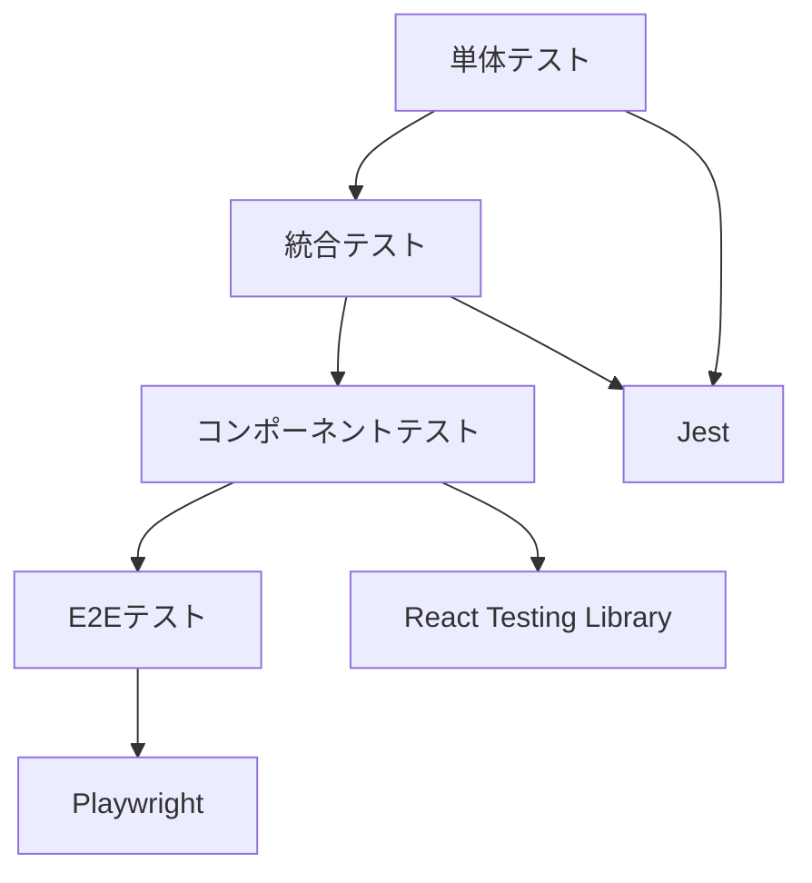
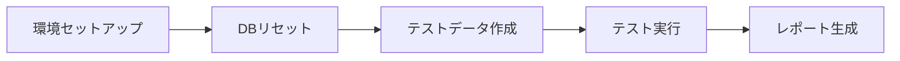
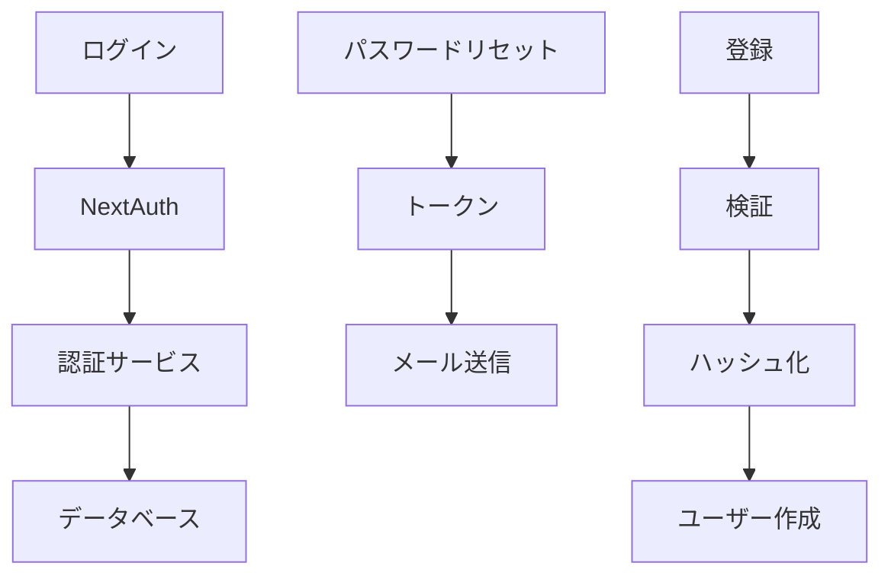

# システムパターン

## アーキテクチャ概要
Next.jsを使用したフルスタックアプリケーション：

## フィーチャーベース構造
各フィーチャーは以下を含む：
- **スキーマ**: データモデル定義
- **コンポーネント**: UI
- **フェッチャー**: データ取得ロジック
- **ハンドラー**: イベント処理
- **フック**: Reactカスタムフック
- **サービス**: ビジネスロジック
- **ミドルウェア**: リクエスト処理中間層

## データフロー

### フォームデータフロー

## 設計パターン
- **リポジトリパターン**: DrizzleORMによるデータアクセス抽象化
- **サービス層パターン**: ビジネスロジック分離
- **フック抽象化**: UIからデータフェッチング分離
- **フィーチャーモジュール**: 機能ごとのコード整理
- **フォームコンポーネントパターン**: 再利用可能なフォーム構築
  - 制御されたコンポーネント
  - バリデーション分離
  - 送信ハンドラー抽象化
- **UIコンポーネントパターン**: Shadcn/UIによるコンポーネント構築
  - アクセシビリティ対応
  - カスタマイズ可能
  - コンポジション重視

## テスト駆動開発（TDD）

### TDDサイクル
1. **赤**: 失敗するテスト作成
2. **緑**: 最小限のコード実装
3. **リファクタリング**: 品質向上

### TDD例外
- スキーマファイル（`schema.ts`）はTDD対象外
- マイグレーションで検証

### テストファイルのESLintエラー解消

1. **型定義ファイル作成**
2. **適切な型アサーション**
3. **@ts-expect-errorの適切使用**
4. **tsconfig.json設定**

### テスト戦略

#### E2Eテスト（Playwright）

1. **環境セットアップ**: グローバルセットアップでテスト環境準備
   - `tests/global-setup.ts`でテスト前の環境初期化
   - `playwright.config.ts`で設定（ブラウザ、タイムアウト、並列実行等）
   - ウェブサーバー自動起動（`npm run dev`）

2. **データベースリセット**: テスト前にDBをクリーンな状態に
   - `tests/helpers/setup-db.ts`でDB操作
   - `resetTestDatabase()`でDBリセット
   - `createTestData()`でテストデータ作成

3. **テストシナリオ**: ユーザー操作を模倣したテスト
   - 認証フロー（`tests/auth.spec.ts`）
   - Todoアプリ操作（`tests/todo-app.spec.ts`）
   - データテスト属性（`data-testid`）を使用したセレクタ

4. **テスト実行モード**:
   - 標準実行: `npm run test:e2e`
   - UI表示モード: `npm run test:e2e:ui`
   - デバッグモード: `npm run test:e2e:debug`

5. **並列実行**: 複数ブラウザでの同時テスト
   - Chromium, Firefox, WebKitでのクロスブラウザテスト
   - `fullyParallel: true`で並列実行

## 技術選定
- **Next.js App Router**: ルーティング・SSR・API統合
- **Drizzle ORM**: 型安全SQLクエリビルダー
- **Docker**: 開発環境一貫性確保
- **フィーチャーベース構造**: メンテナンス性・拡張性向上
- **Shadcn/UI**: 再利用可能なUIコンポーネント
  - Radix UIベース
  - Tailwind CSSスタイリング
  - 高いカスタマイズ性

## 認証システム（NextAuth）

- **NextAuthアダプター**: Drizzle連携
- **認証ロジック**: パスワード管理・トークン処理
- **APIルート分離**: 標準・カスタムエンドポイント
- **パスワード管理分離**: 独立テーブル使用
