# システムパターン

## アーキテクチャ概要
Next.jsを使用したフルスタックアプリケーション：

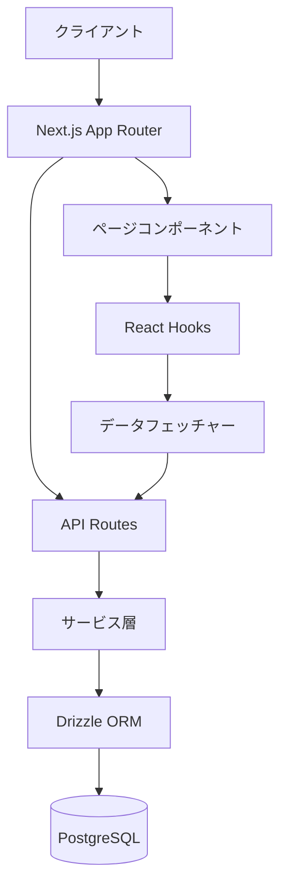

## フィーチャーベース構造
各フィーチャーは以下を含む：
- **スキーマ**: データモデル定義
- **コンポーネント**: UI
- **フェッチャー**: データ取得ロジック
- **ハンドラー**: イベント処理
- **フック**: Reactカスタムフック
- **サービス**: ビジネスロジック
- **ミドルウェア**: リクエスト処理中間層

## データフロー
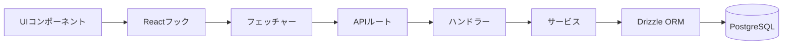

### フォームデータフロー


## 設計パターン
- **リポジトリパターン**: DrizzleORMによるデータアクセス抽象化
- **サービス層パターン**: ビジネスロジック分離
- **フック抽象化**: UIからデータフェッチング分離
- **フィーチャーモジュール**: 機能ごとのコード整理
- **フォームコンポーネントパターン**: 再利用可能なフォーム構築
  - 制御されたコンポーネント
  - バリデーション分離
  - 送信ハンドラー抽象化
- **UIコンポーネントパターン**: Shadcn/UIによるコンポーネント構築
  - アクセシビリティ対応
  - カスタマイズ可能
  - コンポジション重視

## データフェッチングパターン
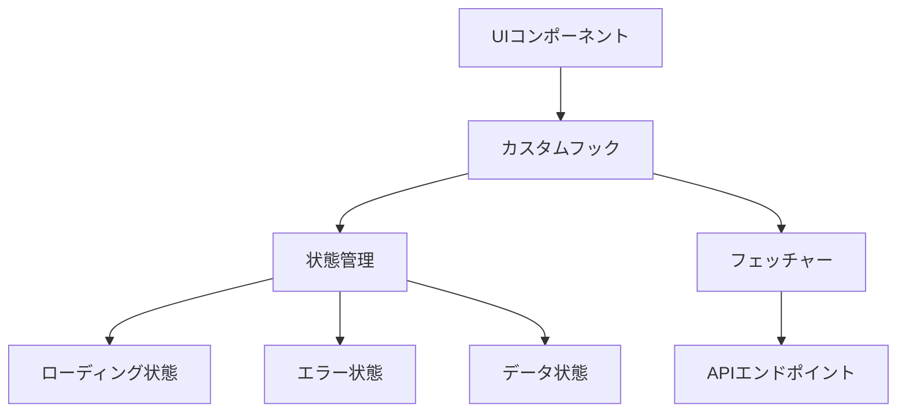

### フェッチャー
- **責務**: APIとの通信を抽象化
- **実装**: `src/features/[feature]/fetchers/[feature].fetcher.ts`
- **特徴**:
  - API通信のみに集中
  - エラーハンドリング
  - 型安全なリクエスト/レスポンス
  - 再利用可能なメソッド
  - UIに依存しない純粋な関数

### カスタムフック
- **責務**: データ状態管理とフェッチャー連携
- **実装**: `src/features/[feature]/hooks/use-[feature].ts`
- **特徴**:
  - Reactの状態管理（useState, useEffect）
  - ローディング状態管理
  - エラー状態管理
  - データキャッシュ
  - UIコンポーネントへのインターフェース提供
  - フェッチャーの呼び出し

### UIコンポーネント
- **責務**: データ表示と操作
- **実装**: `src/features/[feature]/components/[component].tsx`
- **特徴**:
  - カスタムフックを使用したデータ取得
  - ローディング/エラー状態の表示
  - データの表示
  - ユーザー操作のハンドリング

## テスト駆動開発（TDD）
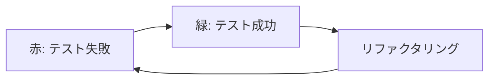

### TDDサイクル
1. **赤**: 失敗するテスト作成
2. **緑**: 最小限のコード実装
3. **リファクタリング**: 品質向上

### TDDの具体的な実践方法

#### 1. テストを書く（赤）
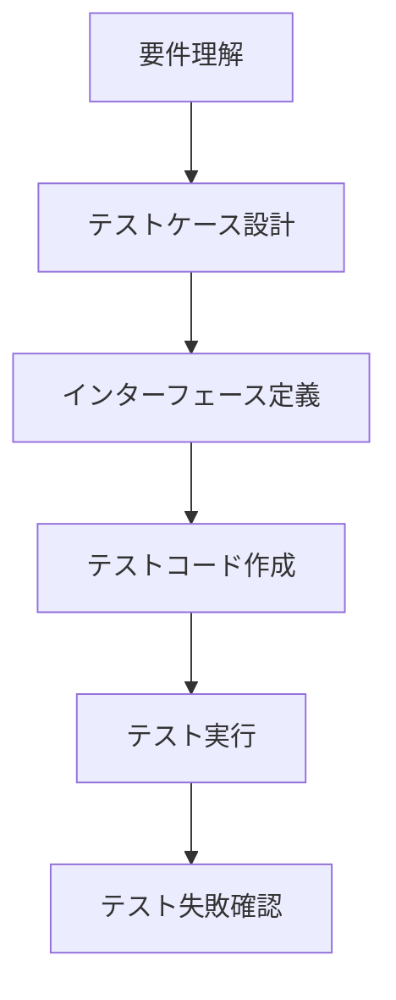

**具体的なステップ**:
1. **要件理解**:
   - 実装する機能の要件を明確に理解する
   - 機能の入力と期待される出力を特定する
   - エッジケースや例外ケースを考慮する

2. **テストケース設計**:
   - 正常系（成功ケース）のテストを設計
   - 異常系（失敗ケース）のテストを設計
   - エッジケースのテストを設計

3. **インターフェース定義**:
   - 実装するクラス/関数のインターフェースを定義
   - 引数と戻り値の型を定義
   - 依存関係を特定

4. **テストコード作成**:
   - テストフレームワーク（Jest）を使用してテストを記述
   - 依存関係をモック化
   - 期待される結果を明確にアサーション

5. **テスト実行と失敗確認**:
   - テストを実行して失敗することを確認
   - 失敗の理由が実装がないためであることを確認

**実装例（auth.handler.test.ts）**:
```typescript
// 1. 要件理解: ユーザー登録機能の実装
// 2. テストケース設計: 正常系 - 有効なデータでユーザー登録
// 3. インターフェース定義: register(req: NextRequest): Promise<NextResponse>
// 4. テストコード作成:
describe('AuthHandler', () => {
  describe('register', () => {
    it('should register a new user and return 201 status', async () => {
      // 準備
      const mockAuthService = {
        registerUser: jest.fn().mockResolvedValue({
          id: 'user-id',
          email: 'test@example.com',
          name: 'Test User'
        })
      };
      const authHandler = new AuthHandler(mockAuthService);
      const mockRequest = {
        json: jest.fn().mockResolvedValue({
          email: 'test@example.com',
          password: 'password123',
          name: 'Test User'
        })
      } as unknown as NextRequest;

      // 実行
      const response = await authHandler.register(mockRequest);

      // 検証
      expect(mockRequest.json).toHaveBeenCalled();
      expect(mockAuthService.registerUser).toHaveBeenCalledWith({
        email: 'test@example.com',
        password: 'password123',
        name: 'Test User'
      });
      expect(response.status).toBe(201);
    });
  });
});
// 5. テスト実行と失敗確認: npm test -- auth.handler.test.ts
```

#### 2. 実装する（緑）
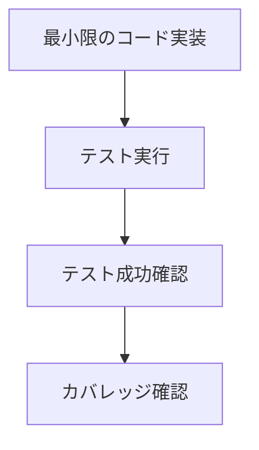

**具体的なステップ**:
1. **最小限のコード実装**:
   - テストを通過するための最小限のコードを実装
   - 完璧なコードを書こうとしない
   - 「動作する最もシンプルな実装」を目指す

2. **テスト実行**:
   - 実装したコードでテストを実行
   - すべてのテストが通過するまで調整

3. **カバレッジ確認**:
   - テストカバレッジを確認
   - 不足している部分があれば追加のテストを検討

**実装例（auth.handler.ts）**:
```typescript
// 1. 最小限のコード実装:
export class AuthHandler {
  private authService: AuthService;

  constructor(authService: AuthService) {
    this.authService = authService;
  }

  async register(req: NextRequest): Promise<NextResponse> {
    const body = await req.json();
    const user = await this.authService.registerUser(body);
    return NextResponse.json(user, { status: 201 });
  }
}
// 2. テスト実行: npm test -- auth.handler.test.ts
// 3. カバレッジ確認: npm test -- auth.handler.test.ts --coverage
```

#### 3. リファクタリングする（リファクタリング）
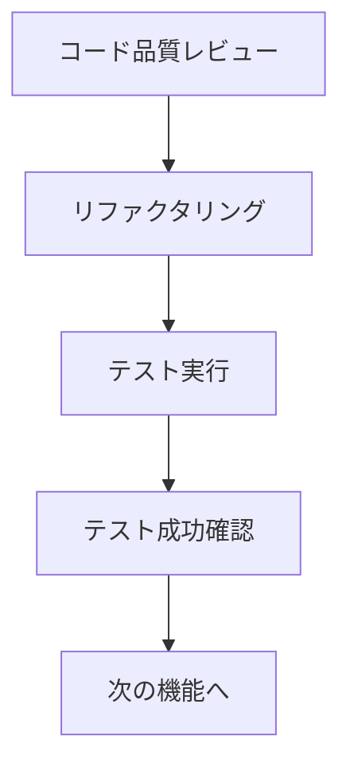

**具体的なステップ**:
1. **コード品質レビュー**:
   - コードの可読性を確認
   - 重複コードを特定
   - パフォーマンスの問題を特定
   - 設計パターンの適用可能性を検討

2. **リファクタリング**:
   - コードの構造を改善
   - 命名を改善
   - 重複を排除
   - パフォーマンスを最適化
   - エラーハンドリングを追加

3. **テスト実行と成功確認**:
   - リファクタリング後にテストを実行
   - すべてのテストが通過することを確認

4. **次の機能へ**:
   - 次の機能のTDDサイクルを開始

**実装例（auth.handler.ts リファクタリング後）**:
```typescript
// 1. コード品質レビュー: バリデーションとエラーハンドリングが不足
// 2. リファクタリング:
export class AuthHandler {
  private authService: AuthService;

  constructor(authService: AuthService) {
    this.authService = authService;
  }

  async register(req: NextRequest): Promise<NextResponse> {
    try {
      // リクエストボディの取得
      const body = await req.json();

      // バリデーション
      const result = registerSchema.safeParse(body);
      if (!result.success) {
        return NextResponse.json(
          { error: 'Invalid request body', details: result.error.format() },
          { status: 400 }
        );
      }

      // ユーザー登録
      const user = await this.authService.registerUser(result.data);

      // 成功レスポンス
      return NextResponse.json(user, { status: 201 });
    } catch (error) {
      // エラーハンドリング
      if (error instanceof Error) {
        if (error.message === 'User with this email already exists') {
          return NextResponse.json(
            { error: 'User with this email already exists' },
            { status: 409 }
          );
        }
      }

      // 予期しないエラー
      console.error('Registration error:', error);
      return NextResponse.json(
        { error: 'An unexpected error occurred' },
        { status: 500 }
      );
    }
  }
}
// 3. テスト実行と成功確認: npm test -- auth.handler.test.ts
// 4. 次の機能へ: forgotPasswordのテスト作成
```

### TDDの実践における注意点

#### 1. テスト粒度の選択
- **小さすぎる粒度**: 実装の詳細に依存しすぎると、リファクタリングが困難になる
- **大きすぎる粒度**: テストが複雑になり、失敗の原因特定が困難になる
- **適切な粒度**: 機能単位でテストし、実装の詳細ではなく動作をテスト

#### 2. モックの適切な使用
- **過剰なモック**: 実装の詳細に依存しすぎると、リファクタリングが困難になる
- **不足したモック**: 外部依存が多いとテストが不安定になる
- **適切なモック**: 外部依存のみをモック化し、テスト対象のコードは実際に実行

#### 3. テストの独立性
- **テスト間の依存**: あるテストの結果が他のテストに影響を与えない
- **テスト順序の独立**: テストの実行順序に依存しない
- **環境の独立**: テスト環境が他のテストによって汚染されない

#### 4. テストの可読性
- **テスト名**: テストの目的が明確に理解できる名前
- **AAA（Arrange-Act-Assert）パターン**: 準備、実行、検証の3つのセクションに分ける
- **コメント**: 複雑なテストには適切なコメントを追加

### TDD例外
- スキーマファイル（`schema.ts`）はTDD対象外
- マイグレーションで検証

### テストファイルのESLintエラー解消
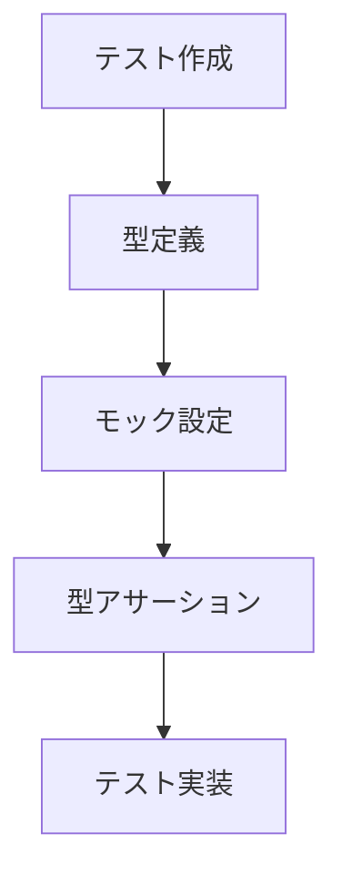

1. **型定義ファイル作成**
2. **適切な型アサーション**
3. **@ts-expect-errorの適切使用**
4. **tsconfig.json設定**

### テスト戦略
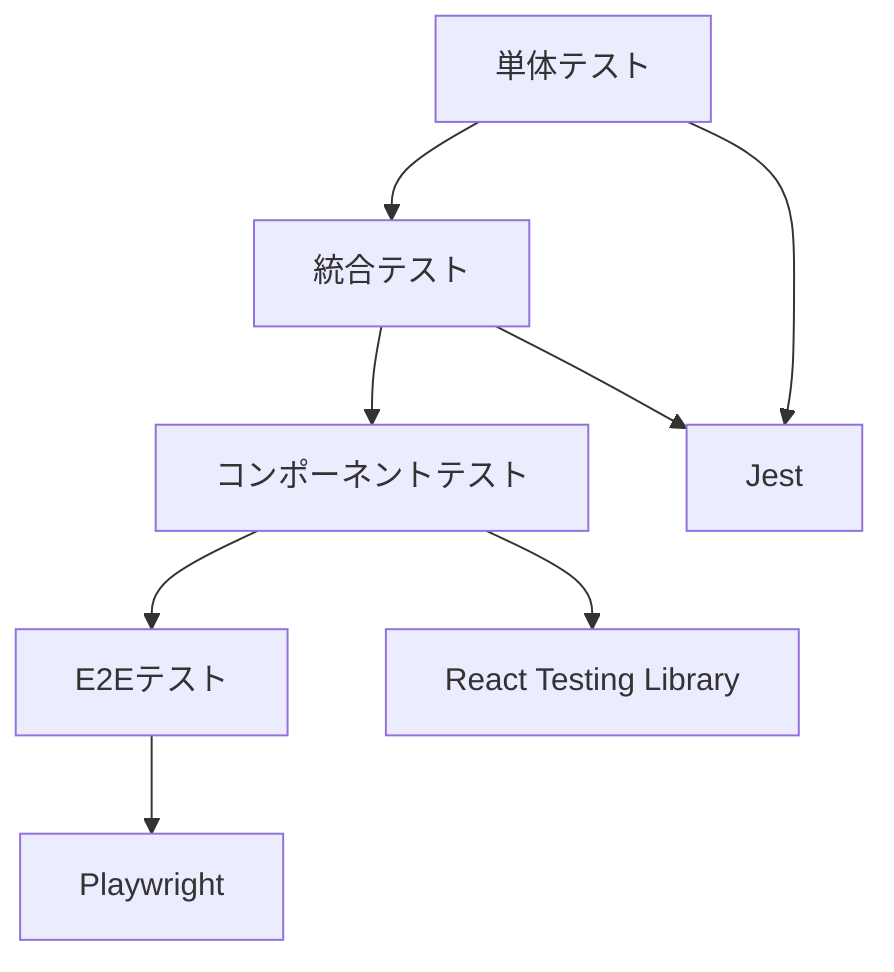

#### E2Eテスト（Playwright）
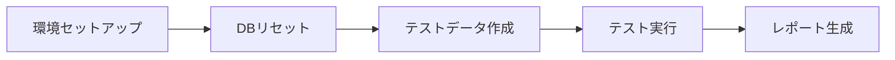

1. **環境セットアップ**: グローバルセットアップでテスト環境準備
   - `tests/global-setup.ts`でテスト前の環境初期化
   - `playwright.config.ts`で設定（ブラウザ、タイムアウト、並列実行等）
   - ウェブサーバー自動起動（`npm run dev`）

2. **データベースリセット**: テスト前にDBをクリーンな状態に
   - `tests/helpers/setup-db.ts`でDB操作
   - `resetTestDatabase()`でDBリセット
   - `createTestData()`でテストデータ作成

3. **テストシナリオ**: ユーザー操作を模倣したテスト
   - 認証フロー（`tests/auth.spec.ts`）
   - Todoアプリ操作（`tests/todo-app.spec.ts`）
   - データテスト属性（`data-testid`）を使用したセレクタ

4. **テスト実行モード**:
   - 標準実行: `npm run test:e2e`
   - UI表示モード: `npm run test:e2e:ui`
   - デバッグモード: `npm run test:e2e:debug`

5. **並列実行**: 複数ブラウザでの同時テスト
   - Chromium, Firefox, WebKitでのクロスブラウザテスト
   - `fullyParallel: true`で並列実行

## Jest設定の最適化
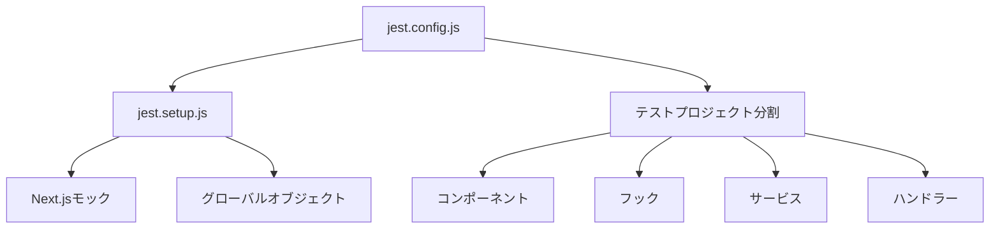

1. **プロジェクト分割**: テスト実行の分離と効率化
   - `components`: UIコンポーネントテスト
   - `hooks`: Reactフックテスト
   - `services`: サービス層テスト
   - `handlers`: APIハンドラーテスト

2. **Next.js環境のモック**:
   - `jest.setup.js`でグローバルオブジェクト設定
   - Next.jsコンポーネントのモック（Link, Image等）
   - Next.js APIのモック（useRouter, useSession等）

3. **ESモジュールサポート**:
   - `transform`設定でts-jestの設定調整
   - `useESM: true`でESモジュールサポート
   - `extensionsToTreatAsEsm`でESM対象拡張子指定

4. **テスト環境の分離**:
   - `setupFilesAfterEnv`でテスト環境設定
   - `testPathIgnorePatterns`で不要なパスを除外
   - `moduleNameMapper`でモジュールパスエイリアス設定

## 技術選定
- **Next.js App Router**: ルーティング・SSR・API統合
- **Drizzle ORM**: 型安全SQLクエリビルダー
- **Docker**: 開発環境一貫性確保
- **フィーチャーベース構造**: メンテナンス性・拡張性向上
- **Shadcn/UI**: 再利用可能なUIコンポーネント
  - Radix UIベース
  - Tailwind CSSスタイリング
  - 高いカスタマイズ性

## 認証システム（NextAuth）
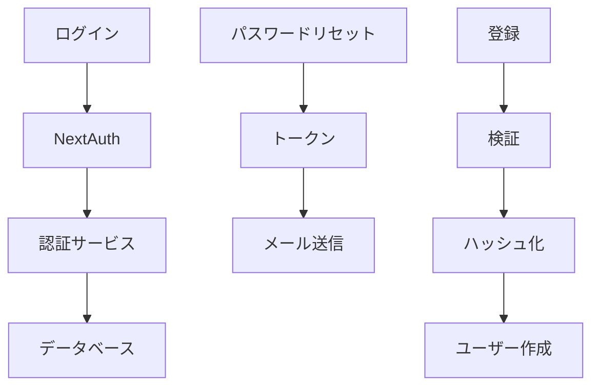

- **NextAuthアダプター**: Drizzle連携
- **認証ロジック**: パスワード管理・トークン処理
- **APIルート分離**: 標準・カスタムエンドポイント
- **パスワード管理分離**: 独立テーブル使用
