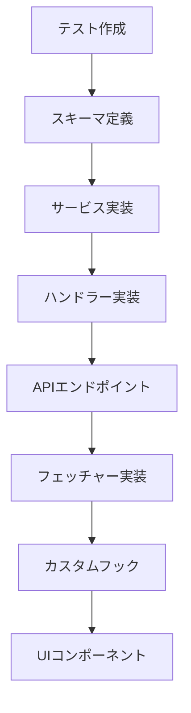
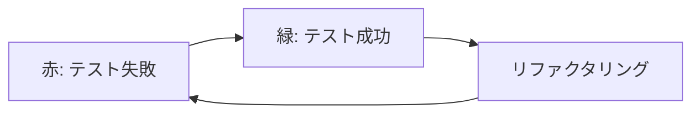
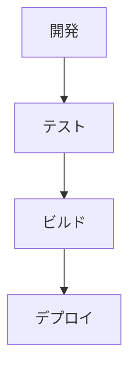

# 技術コンテキスト

## 技術スタック

### フロントエンド
- **Next.js**: App Router使用
- **React**: UIライブラリ
- **Tailwind CSS**: ユーティリティCSS
- **Shadcn/UI**: 再利用可能なUIコンポーネント
- **TypeScript**: 静的型付け

### バックエンド
- **Next.js API Routes**: サーバーサイドAPI
- **Drizzle ORM**: SQLクエリビルダー
- **PostgreSQL**: データベース
- **NextAuth.js**: 認証
- **Resend**: メール送信
- **bcrypt**: パスワードハッシュ化
- **Zod**: バリデーション

### 開発ツール
- **Docker**: 開発環境
- **ESLint**: コード品質
- **Jest**: テストフレームワーク
- **ts-jest**: TypeScript対応
- **React Testing Library**: UIテスト
- **Playwright**: E2Eテスト
- **Supertest**: APIテスト

## 開発環境セットアップ

### 必要条件
- Node.js
- Docker と Docker Compose
- npm または yarn

### 環境変数
`.env.local`に設定：
- DB接続情報
- NextAuth設定（URL, SECRET）
- Resend設定（API_KEY, APP_URL）

### 開発サーバー起動
```bash
npm install
docker-compose up -d
npm run db:migrate
npm run dev
```

## データベース

### 主要スキーマ
- **Todos**: id, title, description, completed, userId, projectId, timestamps
- **Projects**: id, name, description, userId, workspaceId, timestamps
- **Workspaces**: id, name, description, userId, timestamps
- **Users**: NextAuth標準
- **Accounts**: OAuth連携
- **Sessions**: ユーザーセッション
- **VerificationTokens**: メール検証
- **Passwords**: パスワード管理

### マイグレーション
- `npm run db:generate` - 生成
- `npm run db:migrate` - 実行

## アプリケーション構造

### ディレクトリ構造
```
src/
├── app/              # Next.js App Router
│   ├── api/          # APIエンドポイント
│   │   ├── auth/     # 認証API
│   │   └── todos/    # Todo API
├── db/               # DB設定
├── types/            # 型定義
└── features/         # 機能モジュール
    ├── auth/         # 認証
    ├── todos/        # Todo
    ├── projects/     # プロジェクト
    └── workspaces/   # ワークスペース
```

### フィーチャーモジュール
```
features/[feature]/
├── components/       # UI
├── fetchers/         # データ取得
├── handlers/         # イベント処理
├── hooks/            # Reactフック
├── schemas/          # データ定義
└── services/         # ビジネスロジック
```

## 技術的考慮事項

### パフォーマンス
- SSR/CSRの適切な使い分け
- DBクエリ最適化
- 再レンダリング防止

### スケーラビリティ
- モジュール設計
- ステートレスAPI
- 機能の独立性

### セキュリティ
- 入力検証（Zod）
- 認証・認可
- SQLインジェクション対策
- パスワードハッシュ化
- JWT管理

## テスト環境

### テスト種別
- **単体テスト**: 個別関数・メソッドのテスト（Jest）
- **統合テスト**: 複数コンポーネント・サービス間の連携テスト
- **APIテスト**: エンドポイントの動作検証（Supertest）
- **コンポーネントテスト**: UI要素の検証（React Testing Library）
- **E2Eテスト**: ユーザー操作シミュレーション（Playwright）

### Jest設定
- **jest.config.ts**: テスト設定ファイル
  - `preset: 'ts-jest'` - TypeScriptサポート
  - `testEnvironment: 'jsdom'` - DOM環境
  - `moduleNameMapper` - モジュールパスエイリアス
  - `transform` - ファイル変換設定
  - `extensionsToTreatAsEsm` - ESモジュール対応
  - `testPathIgnorePatterns` - Playwrightテスト除外

- **jest.setup.ts**: テスト環境セットアップ
  - Next.js環境のモック
    - MockRequest/MockResponse/MockHeadersクラス実装
  - TextEncoder/TextDecoderのポリフィル
  - @testing-library/jest-domの拡張

### テスト実行
```bash
# 単体・統合テスト
npm test

# テスト監視モード
npm run test:watch

# E2Eテスト
npm run test:e2e

# E2EテストのUIモード
npm run test:e2e:ui

# E2Eテストのデバッグモード
npm run test:e2e:debug
```

## 主要依存パッケージ
- Next.js, React
- Drizzle ORM, PostgreSQL
- NextAuth, bcrypt
- Tailwind CSS, Shadcn/UI
- TypeScript, Zod
- Jest, ESLint, Playwright

## 開発ワークフロー

### 機能開発フロー


### テスト駆動開発


### デプロイメントフロー


## テスト環境の改善

### JSX変換エラー解決
- 問題: `SyntaxError: Unexpected token '<'`
- 原因: `"type": "module"`と`"jsx": "preserve"`の設定がJestと競合
- 解決策:
  - ts-jestの設定調整
    - useESM: true
    - tsconfig: { jsx: 'react-jsx' }
  - extensionsToTreatAsEsmで.tsと.tsxファイルをESモジュールとして扱う

### Next.js環境エラー解決
- 問題: `ReferenceError: Request is not defined`
- 原因: Next.jsのグローバルオブジェクトがテスト環境で未定義
- 解決策:
  - jest.setup.tsでNext.js環境のモック
    - MockRequest/MockResponse/MockHeadersクラス実装
  - 残課題: NextRequest/NextResponseのモック実装

### TextEncoder未定義エラー解決
- 問題: `ReferenceError: TextEncoder is not defined`
- 原因: Node.jsのTextEncoderがテスト環境で未定義
- 解決策:
  - jest.setup.tsでTextEncoder/TextDecoderのポリフィル追加
  - utilモジュールからインポート

### Playwrightテストの分離
- 問題: PlaywrightテストがJestで実行される
- 原因: テストファイルの拡張子が同じ
- 解決策:
  - testPathIgnorePatternsでPlaywrightテストを除外
  - `npm run test:e2e`でPlaywrightテストを実行

### 残りの課題
- NextRequest/NextResponseのモック実装
- ハンドラーテストの構文エラー修正
- 認証関連テストのインポートエラー解消
- テスト実行スクリプトの分離
